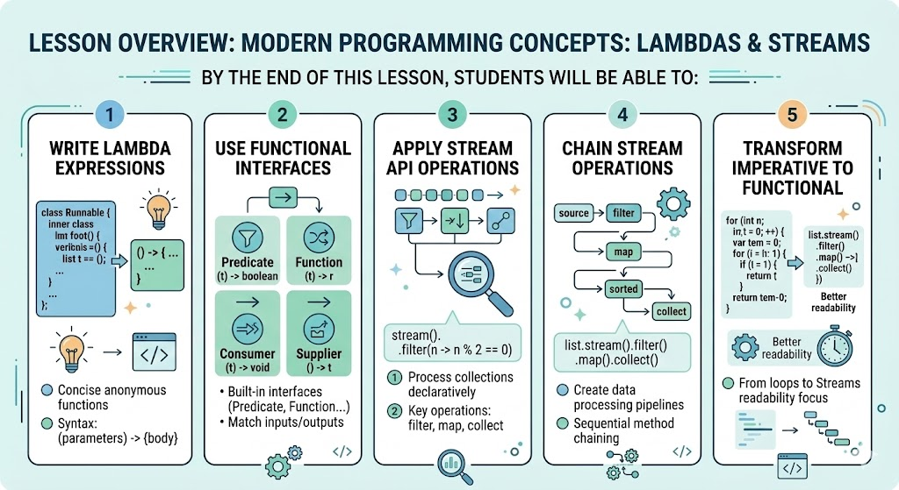

# [3.8] Functional Programming — Lambdas & Streams

## Lesson Overview

## Dependencies
- [Self Studies](./studies.md)
- [Lesson](./lesson.md)
- [Assignment](./assignment.md)
- [Slide Deck](./slides.md)

## Lesson Objectives
* **Write** lambda expressions to replace verbose anonymous classes
* **Use** built-in functional interfaces (Predicate, Function, Consumer)
* **Apply** Stream API operations (filter, map, sorted) to process collections
* **Chain** multiple stream operations to create data processing pipelines

## Lesson Plan

| Duration | What | How or Why |
|----------|------|------------|
| 10 min | Warm up | Recap Lesson 3.7 — OOP pillars, quick Q&A |
| 10 min | Part 1: Intro to Functional Programming | What FP is, why it matters, imperative vs declarative |
| 20 min | Part 2: Lambda Expressions | Syntax, arrow operator, lambda formats; sort/forEach examples |
| 5 min | Activity 1 — Lambda practice | forEach multiply by 3; sort list by length |
| 25 min | Part 3: Functional Interfaces | Predicate, Function, Consumer; custom Calculator interface |
| 5 min | Activity 2 — Functional interfaces practice | Predicate containsA; Function evenOrOdd |
| 10 min | Break | — |
| 30 min | Part 4: Stream API | filter, map, sorted, collect, count; chaining patterns |
| 10 min | Activity 3 — Stream practice | Filter divisible by 3; filter + map + uppercase |
| 15 min | 🔵 Optional: Method References | :: operator, static/instance/constructor references |
| 15 min | Wrap up | Recap lambdas → interfaces → streams; preview assignment; Q&A |
| **Total** | | **155 min — ~25 min buffer** |